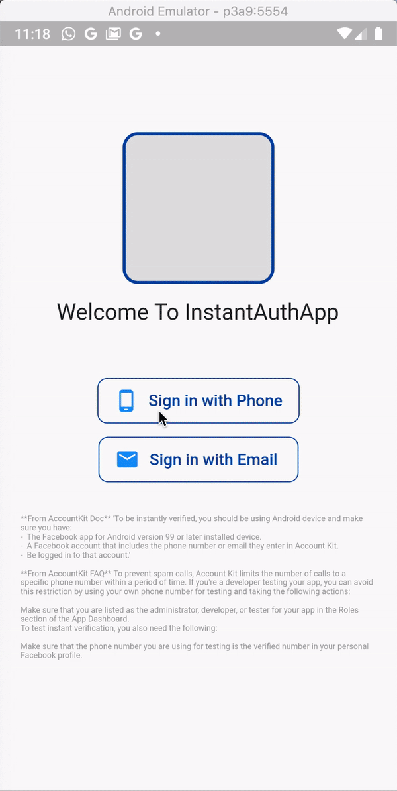

# Instant Verification App

A Flutter app with instant verification implementation using Account Kit by Facebook SDK.

## Getting Started

This project is a starting point for a Flutter application.

A few resources to get you started if this is your first Flutter project:

- [Lab: Write your first Flutter app](https://flutter.dev/docs/get-started/codelab)
- [Cookbook: Useful Flutter samples](https://flutter.dev/docs/cookbook)

For help getting started with Flutter, view our
[online documentation](https://flutter.dev/docs), which offers tutorials,
samples, guidance on mobile development, and a full API reference.

For more about AccountKit by FacebokSDK, go to [Account Kit documentation](https://developers.facebook.com/docs/accountkit/).

Instant Verification implementation and requirement [see here](https://developers.facebook.com/docs/accountkit/overview/#instantverification)

## Demo

## Built with ❤️ using [**dart**](https://dart.dev), [**flutter**](https://flutter.dev) & [**flutter_account_kit**](https://github.com/peerwaya/flutter_account_kit).
Show some ❤️, share and star the repo to support the project.
### Created & Maintained By
[Khalid F.Shuhail](https://github.com/khalidfsh) - [Email.](dev.khalid@me.com)

## License

This project is licensed under the MIT License - see the [LICENSE.md](LICENSE.md) file for details.